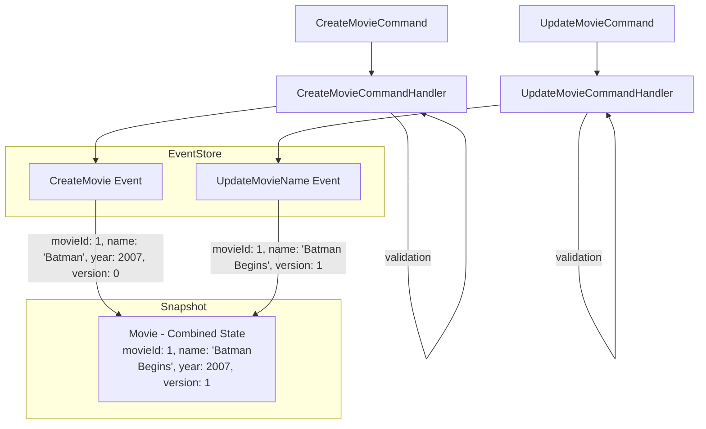

Here are some things that I understand about event sourcing. I have mentioned resources I have used to learn about ES at the end of the article.

## What is Event Sourcing?

By default, we keep the current state of the application in the database.

For example, suppose you have a movie collection. Now you renamed the Movie name from **"Batman"** to **"Batman Begins"**.

Now, in your database, you have replaced the old **"Batman"** with **"Batman Begins"**.

Now, if someone reads your database, they won't know if **"Batman"** was the old name of the movie. Because all they can see is the current state of the film where the title is **"Batman Begins"**.

To preserve the information about the movie called **"Batman"** begins, you can create an audit log.

For example, before setting the value to **"Batman Begins"**, you create a copy of the record or create a separate collection where you say, I am updating **"Batman"** to **"Batman Begins"**.

Here, we update the current state database first and then generate an audit log.

While this is a way to implement an Audit Log, it is hard to implement, and there are many features we can get with Event sourcing that we need to get here.

## Gist of Event Sourcing

Here is the gist of event sourcing:

Don't update the database first. Instead, create an event that says what to do.

When you want to get the current state of the application, replay all the events to get the current state.

For example, for a movie

| Event Type              | Event Data                                       | Resultant State                                   |
|-------------------------|--------------------------------------------------|---------------------------------------------------|
| CreateMovie Event       | `{movieId: 1, name: "Batman", year: 2007, version: 0}` | `{movieId: 1, name: "Batman", year: 2007, version: 0}` |
| UpdateMovieName Event   | `{movieId: 1, name: "Batman Begins", version: 1}`  | `{movieId: 1, name: "Batman Begins", year: 2007, version: 1}` |

To get the current state of `movieId` 1, combine all events related to `movieId` 1:

Combined State = `{movieId: 1, name: "Batman Begins", year: 2007, version: 1}`

To get the current state of `movieId` 1. Combine all events related to `movieId` 1.

So, by combining `CreateMovieEvent` and `UpdateMovieNameEvent`, we get

`{movieId: 1, name: "Batman Begins", year: 2007, version: 1}`

i.e. create the audit log first and let it be the one to dictate how the final state looks.

More simplified: save the Event in the database instead of keeping the final state (there are some nuances here, which I'll explain later).

## Benefits of Event Sourcing

- Rich and Accurate Audit Log
  - In specific applications, you need a very rich and accurate audit log to maintain compliance.
  - ES is the most accurate audit log one can create, and these logs can be used to generate application state.
- Free metrics
  - Rich audit logs based on domain events (a DDD concept) can give free metrics. We won't need additional telemetry.
  - For example, if we have a multi-page form and we are saving events, we may save events such as PersonalDetailsSubmitted, AddressSubmitted, PaymentDetailsAdded, and OrderConfirmed.
  - If we notice in our event store that the user often comes to AddressSubmitted but doesn't initiate PaymentDetailsAdded, something in PaymentDetailsAdded might stop the user. We can go and find out the reason and fix it.
- Replay
  - We can always generate the current state of the application for the list of events, and we can stop at any point.
  - For example, you wanted to see your application's state a year ago. You can replay events from a year ago, and you'll get an accurate state of your system.
  - All the magic of event sourcing is in replaying.
- Debugging
  - Replaying allows for debugging.
  - For example, if you had a bug in your application and want to trace how and why those bugs occurred, you can slowly replay your application state and see exactly what Event caused the bug.
  - You could even use something like binary search (similar to git bisect).
- Correcting History
  - In complex applications where many things are interconnected, ES can be helpful if you make a mistake and want to correct it.
  - For example, a payroll system is a complex application. Suppose an employee had been informed that he had worked 5 hours. Based on his hours, actions occur in other systems. He returned one week later and said it was more than 5 hours. It was actually 20 hours. He wants to correct history.
  - We can change the hours from 5 to 20. but we don't know how to adjust all the other systems. It can get complex. So what we can do is introduce another event and replace it. If all the other systems are connected to the same event store, they can easily recreate their application state.
- Schema optimization and schema change
  - Since we can replay events, we can change the schema for the current state. For example, we need some data in some format for faster reading; we can replay events, create our read-specific fast data, and keep it in DB.
  - We can also generate multiple schemas based on the same Event.

## Resources

- [Event Sourcing • Martin Fowler • YOW! 2016](https://www.youtube.com/watch?v=ck7t592bvBg)
    - Also explains some gotchas with implementing Event Sourcing.
- [Event Sourcing Explained](https://www.youtube.com/watch?v=yFjzGRb8NOk)
    - A visual video